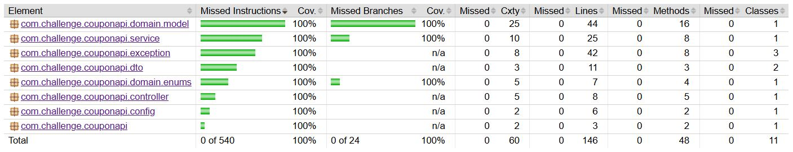

# Coupon Management API

A streamlined RESTful backend for managing discount coupons, developed as a technical challenge. This project focuses on **Domain-Driven Design (DDD)**, **Clean Code**, and robust automated testing.


## Quick Start (Makefile)

The project includes a `Makefile` to simplify development and execution:

- `make build`: Compiles the application and generates the Docker image.
- `make up`: Starts the application container.
- `make test`: Runs unit and integration tests (using **Maven Failsafe** for ITs).
- `make coverage`: Shows the overall test coverage directly in the terminal.
- `make logs`: Displays container logs in real time.
- `make clean`: Clears temporary Maven files.


## Requirements

- Java 17
- Docker & Docker Compose (Optional)
- Maven 3.x


## Architectural Decisions

- **Rich Domain Model:** Business logic and validations are encapsulated within the `Coupon` entity, avoiding "Anemic Domain Models."

- **Hexagonal/DDD Principles:** Clear separation between Domain, Application (Service), and Infrastructure (Web/Persistence).

- **Validation via Records:** Using Java **Records** for DTOs with built-in validation to ensure data integrity before it reaches the service layer.

- **Soft Delete:** Coupons are never physically removed. The `@SQLDelete` and `@SQLRestriction` annotations handle logical deletion (`Status.DELETED`).

- **Global Exception Handling:** A centralized controller advice maps business and resource exceptions to standardized [RFC 7807](https://www.rfc-editor.org/info/rfc7807) problem details.


## Directory Structure

```plaintext
challenge-coupon-api/
├── docs/                       # Project documentation and technical specifications
│   └── assets/                 # Static media (screenshots and diagrams) for README/docs
├── src/
│   ├── main/
│   │   ├── java/com/challenge/couponapi/
│   │   │   ├── config/         # Infrastructure & Framework configurations
│   │   │   ├── controller/     # Web Layer (REST Endpoints)
│   │   │   ├── domain/         # Core Business Logic (Entities & Enums)
│   │   │   ├── dto/            # Data Transfer Objects (Java Records)
│   │   │   ├── exception/      # Custom Business & Infrastructure Exceptions
│   │   │   ├── repository/     # Repository Interfaces (Output Ports)
│   │   │   └── service/        # Application Logic (Orchestration)
│   │   └── resources/          # Application properties and static configs
│   └── test/                   # Unit and Integration test suites
├── docker-compose.yml          # Docker orchestration and environment setup
├── Dockerfile                  # Application container image definition
├── Makefile                    # Automation shortcuts (build, test, up)
├── pom.xml                     # Maven project configuration
└── README.md                   # Project overview and documentation
```


## API Endpoints & Documentation

**Interactive Documentation**

Once the application is running, access the **Swagger UI** for full API documentation and testing:
`http://localhost:8080/swagger-ui.html`

**Summary of Routes**

| **Method** | **Endpoint**                | **Description**                               |
|------------|-----------------------------|-----------------------------------------------|
| **POST**   | `/coupons`                | Creates a new validated coupon                |
| **GET**    | `/coupons/{id}`          | Retrieves a coupon by its UUID                |
| **GET**    | `/coupons/code/{code}` | Retrieves a coupon by its unique string code  |
| **DELETE** | `/coupons/{id}`          | Performs a **soft delete** on the coupon          |


## Error Reference Table

The API uses a standardized error format (RFC 7807). Below are the business and validation errors mapped by the `GlobalExceptionHandler`:

| **Title**  | **HTTP Status**             | **Trigger Scenario**                          |
|------------|-----------------------------|-----------------------------------------------|
| **Resource Not Found** | 404 Not Found      | When a UUID or Code does not exist in the database. |
| **Invalid Input Data** | 400 Bad Request    | When Bean Validation fails (e.g., missing fields, invalid discount range). |
| **Business Rule Violation** | 422 Unprocessable Entity | When a business logic is violated (e.g., duplicate coupon code or expired coupon). |
| **Internal Server Error** | 500 Internal Error | Generic unexpected failures (catch-all handler). |

**Error Response Example**

When a validation fails, the API returns a detailed list of fields:

```json
{
  "title": "Invalid Input Data",
  "status": 400,
  "timestamp": "2026-03-31T19:00:57",
  "detail": "One or more fields failed validation.",
  "errors": [
    { "field": "discountValue", "message": "must be at least 0.5" }
  ]
}
```


## Testing & Coverage

The project implements a testing pyramid including Unit and Integration tests.

- **Execution:** Run `make test`.

- **Reports:** After running tests, the **JaCoCo** report is generated at:
`target/site/jacoco/index.html`

- **Terminal Quick View:** Use `make coverage` to see the percentage summary without leaving the console.

**Coverage Overview:**



> *Note: The image above reflects the 100% coverage achieved across core business services and domain models.*


## Database (H2)

The application uses an `H2 Persistent File-based database` located in the `./data` folder. This ensures data persists across application restarts while remaining lightweight.

- **Console Access:** `http://localhost:8080/h2-console`

- **JDBC URL:** `jdbc:h2:file:./data/coupondb;AUTO_SERVER=TRUE;DB_CLOSE_DELAY=-1;NON_KEYWORDS=KEY,VALUE`

- **Credentials:** Username: `sa` | Password: `password`

**Database (H2) Configuration Details:**

The application is configured with specific H2 parameters to ensure stability and compatibility:

- `NON_KEYWORDS=KEY,VALUE`: Prevents syntax conflicts by telling H2 to ignore reserved SQL words often used in coupon logic.

- `DB_CLOSE_DELAY=-1`: Ensures the in-memory schema and data remain alive as long as the JVM is running, preventing data loss between connection polls.

- `AUTO_SERVER=TRUE`: Enables "Automatic Mixed Mode," allowing external tools (like the H2 Console or DBeaver) to connect to the database even while the application is active.


## Troubleshooting

**Intermittent `ECONNRESET` in Postman (Windows)**

If you experience `ECONNRESET` or `Connection reset` errors when testing endpoints via **Postman** on Windows (either running natively or via Docker), this is likely due to how the Windows networking stack handles TCP Keep-Alive signals with `localhost`.

**Solution:**
In Postman, go to the `Headers` tab of your request and manually add the following header:

- **Key:** `Connection`
- **Value:** `close`

This forces the server and the client to terminate the TCP connection immediately after the response is sent, preventing the "race condition" where Postman tries to reuse a socket that the Windows OS has already flagged for closure.


## Docker: Running & Testing

The application is fully containerized to ensure environmental consistency. The `Makefile` abstracts the Docker commands for a smoother experience.

- **Prerequisites:** Ensure **Docker** and **Docker Compose** are installed and running.

- **Build & Up:** Run `make build` followed by `make up`. This will:
  1. Compile the Java application using Maven.
  2. Build a Docker image based on `eclipse-temurin:17-jre`.
  3. Start the Spring Boot application and map port **8080** to your host.

- **Testing in Docker:** To execute the full test suite, use `make test`. The testing environment is configured to use an **In-Memory H2 Database**, ensuring that tests are isolated, fast, and do not interfere with local data files. This process validates the application's internal logic and API routing within a Linux-based container.

- **Persistent Data (Dev/Prod):** When running the application normally, the H2 database uses **file-based persistence** stored in the `./data` directory. This ensures that your coupons and configurations persist even if the container is restarted or recreated.


### Docker Verification & Management

Before running any commands, ensure the Docker engine is active. On **Windows**, make sure **Docker Desktop** is started and the engine is "Running".

- **List running containers:** Verifies if the API is active and on which port.
`docker ps`

- **List local images:** Confirms the `challenge-coupon-api-app` image was built successfully.
`docker images`

- **Follow real-time application logs:** Essential for checking the Spring Boot startup banner.
`docker logs -f coupon-api`

- **Check mapped ports:** Verifies if port **8080** is correctly bound to the host.
`docker port coupon-api`

- **Inspect internal data:** Useful for checking the persistent H2 database file.
`docker exec -it coupon-api ls -R ./data`

> **Note:** If you encounter a "daemon not running" error, please start **Docker Desktop** and wait for the service to initialize before using `make build` or `make up`.


## Observability & Logs

To ensure the application is "production-ready", we implemented:

- **Structured Logging:** Using **SLF4J/Logback** with a clean configuration. SQL queries are formatted for readability during development (check `spring.jpa.properties.hibernate.format_sql`).

- **Unique Identifiers:** Every resource uses **UUID (v4)** instead of sequential IDs. This prevents "ID Enumeration" attacks and makes the system safer for distributed environments.


## CI/CD Ready

The project is structured to be easily integrated into any CI/CD pipeline (GitHub Actions, GitLab CI, or Jenkins):

- **Stateless Build:** The `mvn clean verify` command is all you need to validate a Pull Request.

- **Docker Layer Caching:** The `Dockerfile` is optimized to cache dependencies, making deployments faster.

- **Automated Quality Gate:** The `make coverage` command can be used as a "Check" to block merges if the coverage falls below a defined threshold.


## Future Improvements & Roadmap

This project was designed as a foundation. To evolve it into a production-ready microservice, the following enhancements are suggested:

- **Security & Identity:**

  - **Spring Security & JWT:** Implement stateless authentication to protect management endpoints (e.g., only admins can delete coupons).

  - **RBAC (Role-Based Access Control):** Differentiate between "Customer" (can only view/redeem) and "Admin" (can create/delete).

- **Infrastructure & Resilience:**

  - **PostgreSQL Migration:** Replace H2 with a robust relational database for production environments.

  - **Rate Limiting:** Implement **Bucket4j** or **Redis**-based rate limiting to prevent brute-force coupon code guessing.

  - **Caching:** Integrate **Redis** to cache frequently accessed coupons by code, reducing database load.

- **Feature Expansion:**

  - **Redemption Logic:** Add a `POST /coupons/{id}/redeem` endpoint with concurrency control (Optimistic Locking) to prevent double-redemption.

  - **Bulk Generation:** Endpoint to generate thousands of unique, randomized coupon codes in a single batch.

  - **Audit Logging:** Track who created or deleted each coupon for compliance.

- **Quality & Observability:**

  - **Actuator & Micrometer:** Add Prometheus metrics and health check endpoints for monitoring.

- **Security & Cloud:**

  - **Environment Isolation & Secrets:** Transition from `application.properties` to **Environment Variables** and integrate with a **Secret Manager** (like AWS Secrets Manager or HashiCorp Vault) to protect sensitive data like database credentials and JWT keys.

  - **Database Versioning with Flyway:** Implement **Flyway** migrations for **PostgreSQL** to ensure a consistent, versioned database state across all environments, replacing `ddl-auto` with a production-grade schema evolution process.